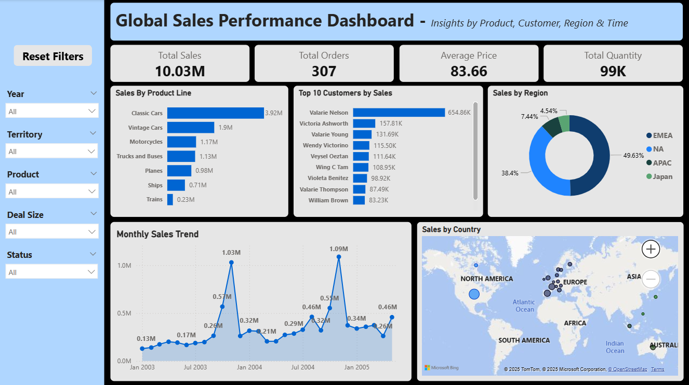

# Global Sales Performance Dashboard
Interactive Power BI dashboard for global sales performance analysis

This project is an interactive **Power BI dashboard** built to analyze global sales data by product line, region, and customer. It visualizes over **$10M in total sales**, providing key insights through dynamic visuals and filters.

## Features

- KPI Cards: Total Sales, Orders, Quantity, Avg Price
- Sales by Product Line
- Top 10 Customers by Sales
- Sales by Region & Country (with map)
- Monthly Sales Trend
- Interactive Filters: Year, Territory, Product, Deal Size, Status
- Reset Filter Button

## Tools Used

- Power BI (Data Modeling, DAX, Visualizations)
- Microsoft Excel (Source Data)
- Bing Maps (Power BI built-in)

## Dashboard Preview

## File

- `Global Sales Performance Dashboard.pbix` — Power BI file
- `GlobalSalesPerformanceDashboard.png` — Dashboard image preview

## What I Learned

- Using DAX for calculated columns & measures
- Designing user-friendly layouts
- Slicing data by multiple dimensions
- Customizing tooltips and filter experiences
- Telling a story with data

## Data Source

Sample sales dataset containing fictional order data:  
> `ORDERNUMBER`, `ORDERDATE`, `PRODUCTLINE`, `SALES`, `COUNTRY`, `STATUS`, etc.

## Contact

Want to collaborate or give feedback?  
Reach out on [LinkedIn](https://www.linkedin.com/in/satya-k-1492b7208/) or drop a message!
